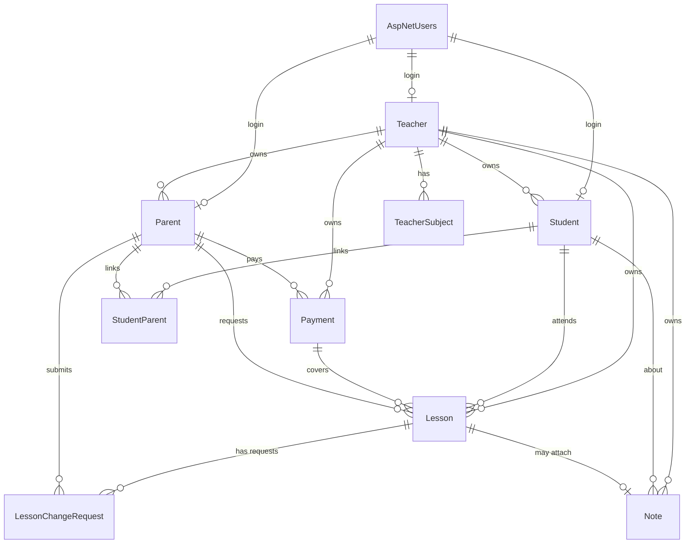

# תלמידון — מבנה בסיס הנתונים (Schema)

> שלב 3 מתוך 5. בסיס נתונים: PostgreSQL + EF Core.
> **עודכן:** 2026-06-25 — *ממתין לאישור*

---

## עיקרון מנחה: רב-דיירות (Multi-Tenancy)

**המורה היא ה-Tenant.** לכל ישות בבעלות מורה יש עמודת `TenantId`
(= מזהה המורה הבעלים). EF Core Global Query Filter יחיל אוטומטית
`WHERE TenantId = @currentTenant` על כל שאילתה, כך שאין דליפת מידע בין מורות.

**שתי שכבות בקרת גישה:**
1. **בידוד דייר** (Tenant filter) — מורה רואה רק את ה-Tenant שלה.
2. **בקרה ברמת שורה** — הורה/תלמיד רואים רק את התלמיד/ים שלהם (נאכף בשכבת ה-API/Authorization מעל מסנן הדייר).

---

## טבלאות

### Identity (מובנה ב-ASP.NET Core Identity)
- `AspNetUsers` — חשבון התחברות (Email, PasswordHash, ...). כל מורה/הורה/תלמיד = משתמש כאן.
- `AspNetRoles` / `AspNetUserRoles` — תפקידים: `Teacher`, `Parent`, `Student`, `Admin`.

### Teacher (שורש הדייר)
| שדה | טיפוס | הערות |
|------|-------|-------|
| Id (PK) | Guid | = ה-TenantId של כל הנתונים שלה |
| UserId (FK) | string | → AspNetUsers |
| FullName | string | |
| Phone | string | |
| Bio | text | תיאור לדף הציבורי |
| DefaultPricePerLesson | decimal | מחיר ברירת מחדל לשיעור |
| RulesText | text | כללי ביטול/תשלום (דף הכללים האישי) |
| ContactInfo | text | פרטי יצירת קשר לדף הכללים |
| IsPublic | bool | האם להציג בספרייה הציבורית |
| CreatedAt | timestamptz | |

### TeacherSubject (תחומי הוראה — לספרייה הציבורית)
| שדה | טיפוס | הערות |
|------|-------|-------|
| Id (PK) | Guid | |
| TenantId (FK) | Guid | → Teacher |
| Name | string | למשל "מתמטיקה", "אנגלית" |

### Student
| שדה | טיפוס | הערות |
|------|-------|-------|
| Id (PK) | Guid | |
| TenantId (FK) | Guid | → Teacher (הבעלים) |
| UserId (FK, nullable) | string | → AspNetUsers (תלמיד צעיר עשוי לא להתחבר) |
| FullName | string | |
| BirthDate | date | (אופציונלי) |
| GradeLevel | string | כיתה/שכבה |
| GeneralInfo | text | מידע כללי בכרטיס |
| IsActive | bool | |
| CreatedAt | timestamptz | |

### Parent
| שדה | טיפוס | הערות |
|------|-------|-------|
| Id (PK) | Guid | |
| TenantId (FK) | Guid | → Teacher |
| UserId (FK) | string | → AspNetUsers |
| FullName | string | |
| Email | string | יעד התזכורות ואישורי התשלום |
| Phone | string | |

### StudentParent (קישור N:N)
| שדה | טיפוס | הערות |
|------|-------|-------|
| StudentId (FK) | Guid | מפתח מורכב |
| ParentId (FK) | Guid | מפתח מורכב |
| TenantId | Guid | |

> הורה אחד → מספר ילדים; תלמיד → עד שני הורים. לכן N:N.

### Lesson (שיעור / יומן)
| שדה | טיפוס | הערות |
|------|-------|-------|
| Id (PK) | Guid | |
| TenantId (FK) | Guid | → Teacher |
| StudentId (FK) | Guid | → Student |
| StartTime | timestamptz | מתי התלמיד מגיע |
| EndTime | timestamptz | |
| Status | enum | **Requested** / **Scheduled** / Completed / Cancelled / Declined |
| Origin | enum | מי יזם: Teacher / Parent |
| RequestedByParentId (FK, nullable) | Guid | מי ביקש (אם נפתח ע"י הורה) |
| Homework | text (nullable) | שיעורי בית. **ריק → התלמיד לא רואה את השדה** |
| PaymentRequired | bool | המורה מסמנת בסוף השיעור |
| Amount | decimal | החיוב על השיעור (ברירת מחדל ממחיר המורה) |
| PaymentId (FK, nullable) | Guid | → Payment. `null` = טרם שולם |
| CompletedAt | timestamptz | |

> **תהליך קביעה:** הורה בוחר תאריך → שיעור נוצר כ-`Requested` (ממתין לאישור).
> המורה מאשרת → `Scheduled`, או דוחה → `Declined`. מורה שפותחת שיעור בעצמה → ישר `Scheduled`.
>
> **סטטוס תשלום של שיעור** = האם `PaymentId` מאוכלס.
> שיעור פתוח לתשלום = `PaymentRequired = true` וגם `PaymentId = null`.

### Payment (אירוע תשלום / קבלה)
| שדה | טיפוס | הערות |
|------|-------|-------|
| Id (PK) | Guid | |
| TenantId (FK) | Guid | → Teacher |
| ParentId (FK) | Guid | מי שילם |
| Amount | decimal | סכום ששולם בפועל |
| PaidDate | date | |
| Method | string | מזומן/העברה/ביט... (חופשי) |
| Note | text | |
| ConfirmationSentAt | timestamptz | מתי נשלח מייל אישור |

> תשלום אחד יכול לכסות **מספר שיעורים** (1:N → Lesson.PaymentId).

### LessonChangeRequest (בקשת שינוי/ביטול שיעור)
| שדה | טיפוס | הערות |
|------|-------|-------|
| Id (PK) | Guid | |
| TenantId (FK) | Guid | → Teacher |
| LessonId (FK) | Guid | → Lesson |
| RequestedByParentId (FK) | Guid | מי ביקש |
| Type | enum | Cancel / Reschedule |
| ProposedStartTime | timestamptz (nullable) | תאריך/שעה מבוקשים (ל-Reschedule) |
| ProposedEndTime | timestamptz (nullable) | |
| Reason | text (nullable) | סיבת הבקשה |
| Status | enum | Pending / Approved / Rejected |
| CreatedAt | timestamptz | |
| ResolvedAt | timestamptz (nullable) | מתי המורה הכריעה |

> הורה שולח בקשה → `Pending`. רק באישור המורה (`Approved`) השינוי מוחל בפועל:
> ביטול → `Lesson.Status = Cancelled`; שינוי מועד → עדכון `StartTime`/`EndTime`.

### Note (הערה פדגוגית / מעקב התקדמות)
| שדה | טיפוס | הערות |
|------|-------|-------|
| Id (PK) | Guid | |
| TenantId (FK) | Guid | → Teacher |
| StudentId (FK) | Guid | → Student |
| LessonId (FK, nullable) | Guid | הערה יכולה להיקשר לשיעור |
| Content | text | |
| VisibleToStudent | bool | מתג נראוּת |
| VisibleToParent | bool | מתג נראוּת |
| CreatedAt | timestamptz | |

> ברירת מחדל: אם `VisibleToStudent = true` → גם `VisibleToParent = true` (ניתן לשנות ידנית).

### (אופציונלי) EmailLog
תיעוד מיילים שנשלחו (תזכורות/אישורים) — לבקרה ומניעת כפילויות. נחליט בשלב 5.

---

## דיאגרמת קשרים (ERD)

---

## החלטות שנסגרו
- **תחומים** — חופשי לכל מורה (`TeacherSubject`). ✅
- **קביעת שיעור** — הורה מבקש (`Requested`) / מורה מאשרת או פותחת ישירות. ✅
- **ביטול/שינוי מועד** — דרך `LessonChangeRequest` באישור המורה בלבד. ✅
- **שיעורי בית** — שדה `Homework` אופציונלי על השיעור; ריק → לא מוצג לתלמיד. ✅

- **שיעורים חוזרים** — ל-MVP: שיעורים **בודדים** בלבד. לוח קבוע חוזר
  (`RecurrenceRule`/`ScheduleTemplate`) יתווסף כשיפור עתידי. ✅
